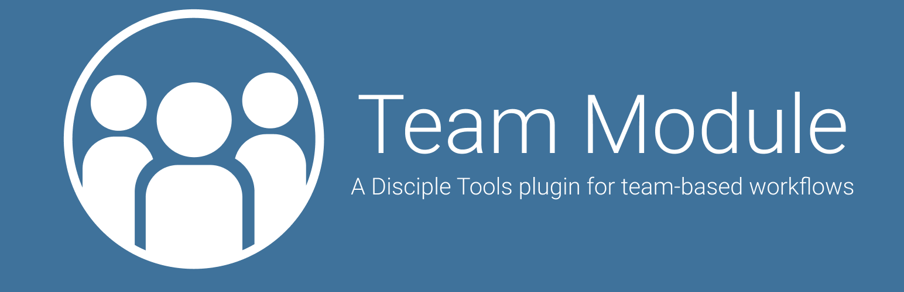
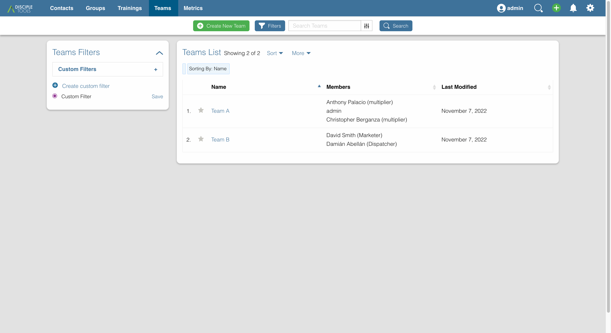
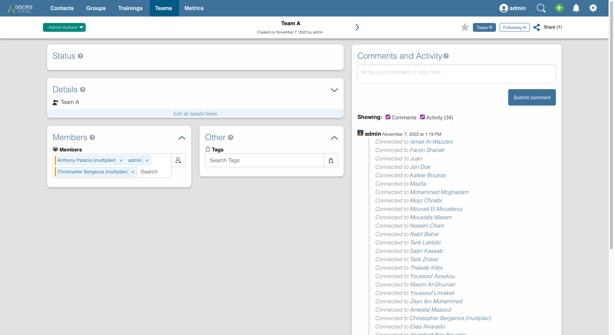
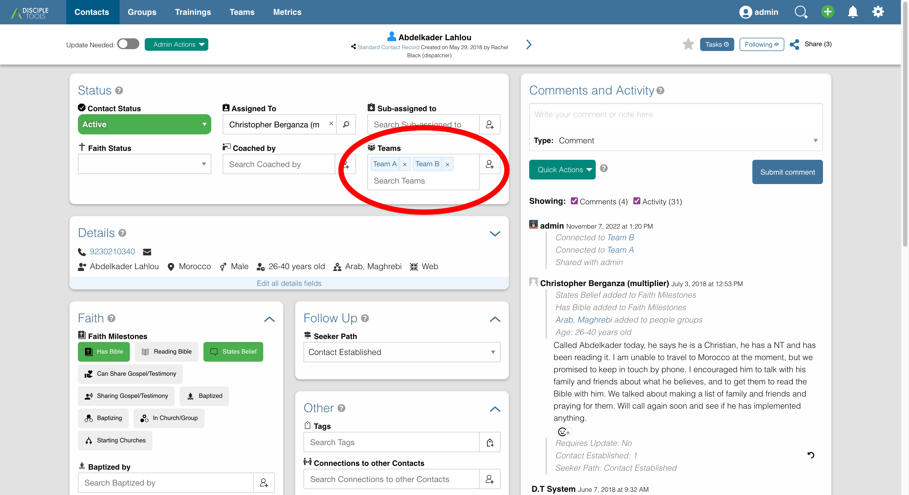
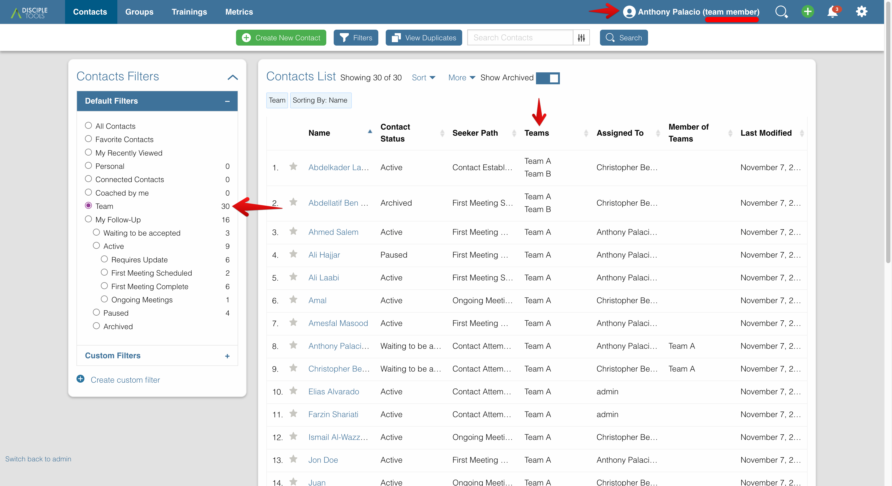
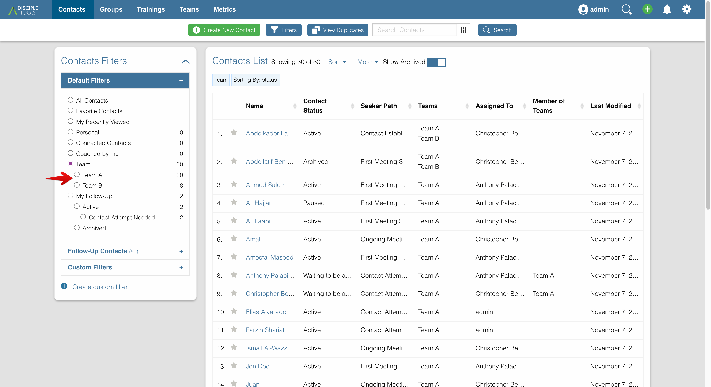

# Disciple.Tools - Team Module

The team module is a way to access and share contacts and groups in a collaborative team setting, where no individual is responsible for a given contact, but the whole team oversees his or her journey.

The module adds a new Team post type for you to set up and manage your teams. Just create a new team and assign any users to be members of it.

Now, on any contact, group, or other post type, you see a list of teams that you can assign it to. By assigning a contact to a team, any member of that team now has access to view and edit it.

A team member user role is available to give the needed permissions to your users. A team member will see only the contacts, groups, and other posts that are either assigned to their team or directly shared with them. 

A team collaborator role allows a user to see all of the contacts, groups, and other post types in the system. This allows them to communicate between teams and assign contacts to additional teams when needed. On their list view, they have a quick filter to view just those posts that are assigned to their team or any other team.

If you use Disciple Tools in this kind of team-based workflow, give the team module a try and see how it can increase your collaborative efforts. It can be used both with and without the Access Module enabled.

https://youtu.be/7Ww_tTDrtio
## Usage

#### Will Do

- Adds `Team` post type with name and members
- Adds `Team Member` role to give access to only those posts assigned to user's team
- Disables Access Module's auto-assignment of new contacts to base user

#### Will Not Do

### Roles
#### Team Member
User will see only the contacts, groups, and other posts that are either assigned to their team 
or directly shared with them.

**Permissions:**
- Create/View/Update/Assign contacts assigned to team/self
- Create/View/Update groups assigned to team/self
- Create/View/Update trainings assigned to team/self
- List users
- List teams

#### Team Collaborator
User can see all of the contacts, groups, and other post types in the system. 
This allows them to communicate between teams and assign contacts to additional teams when needed. 
On their list view, they have a quick filter to view just those posts that are assigned to their 
team or any other team.

**Permissions:**
- All Team Member permissions (above)
- View/Update/Assign any access contacts
- View/Update any groups
- View/Update any trainings

#### Team Leader
User can see all of the contacts, groups, and other post types in the system.
User can see all teams but can only edit their own.

**Permissions:**
- All Team Collaborator permissions (above)
- View any teams
- Update own teams

#### Teams Admin
User can access and edit all post types, including creating and updating all teams.

**Permissions:**
- All Team Leader permissions (above)
- Create/View/Update any teams

## Requirements

- Disciple.Tools Theme installed on a Wordpress Server

## Installing

- Install as a standard Disciple.Tools/Wordpress plugin in the system Admin/Plugins area.
- Requires the user role of Administrator.

## Contribution

Contributions welcome. You can report issues and bugs in the
[Issues](https://github.com/cairocoder01/disciple-tools-team-module/issues) section of the repo. You can present ideas
in the [Discussions](https://github.com/cairocoder01/disciple-tools-team-module/discussions) section of the repo. And
code contributions are welcome using the [Pull Request](https://github.com/cairocoder01/disciple-tools-team-module/pulls)
system for git. For a more details on contribution see the
[contribution guidelines](https://github.com/cairocoder01/disciple-tools-team-module/blob/master/CONTRIBUTING.md).

## Screenshots

